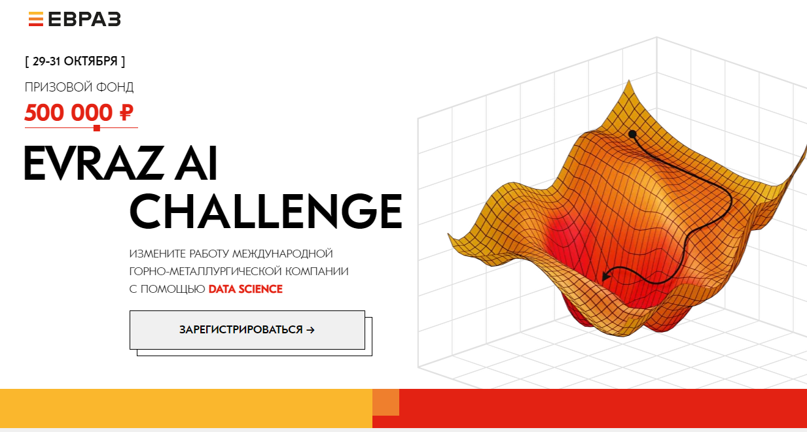

# EVRAZ AI metallurgy hackathon
Продуйте металл через Data Science
---
Даты проведения: 29-31 October 2021                                                       https://hackathon.evraz.com

### Результат: занял 46 место в соло из 64 команд с количеством участников от 1 до 5 в каждой команде. Команда называлась "Pink cow".




### Задача - разработать алгоритм предсказания содержание углерода и температуру чугуна.

В этой задаче две подзадачи:
- Реализовать алгоритм, предсказывающий содержание углерода и температуры чугуна на момент конца плавки металла
- Задача из реального мира – придумать как обобщить алгоритм из пункта 1 на ситуацию реального производства. В реальном времени мы не знаем, когда наступит конец продувки, а должны определить это сами на основании прогнозируемых параметров чугуна. Что нужно добавить? Как перейти от модельной задачи к задаче из реального мира? Как развить алгоритм так, чтобы это было максимально полезно бизнесу?

[Подробное описание](https://russianhackers.notion.site/1-Data-Science-4cc89ba42de1429bbac316f59bf07a3b)

## Контекст
```При производстве стали чугун "продувается" кислородом для удаления примесей. Этот процесс идёт в среднем 15-25 минут при температуре около 1600 градусов. За процессом следит машинист дистрибутора, который на основе своего опыта и специальных знаний определяет момент, когда процесс продувки нужно остановить. В процессе продувки металл насыщается кислородом, а его температура увеличивается. Если "передуть" чугун – сгорит больше металла и на выходе будет меньше стали, что приведет к потере прибыли, если "недодуть", то марка стали не будет удовлетворять заданным критериям и нужно будет "додувать", что замедляет производительность цеха.```

```Вам предстоит разработать алгоритм прогнозирования параметров чугуна – что может стать отличным помощником для машиниста и существенно улучшить производство ЕВРАЗа```

## Структура репозитория

- **notebooks** - папка для ноутбуков с решениями
  - 0_data_prepare.ipynb - ноутбук где обрабатываются и объединяются данные и выгружаются в pkl
  - auto_eda.ipynb - авто EDA
  - 2_lama_2.ipynb - Light Auto ML решение
  - **7_model_tatget_log_exp_metric_another_reg.ipynb** - лучшее решение после окончания хакатона (с логарифмированием и регуляризацией параметром reg_lambda (скор: 0.5423 / 0.5391)
- **submits** - папка для хранения сабмитов (csv-файл + ноутбук в zip-архиве)
- presentations.md - некоторые наиболее интересные скриншоты презентаций топ-7 участников.

## Что сделано
- мёрдж данных
- агрегация и создание признаков
- Построение схемы кросс-валидации
- LightGBM, XGBoost
- Регуляризация (количеством деревьев)
- Отбор признаков
- **Занято 46 место**, выступая в соло из в 64 командах.

## Потрачено времени
- 32 часа по собственным подсчётам за перид времени с 18:00 пятницы 29 октября до 09:00 воскресенья 31 октября.
- WakaTime утверждает что было потрачено 39 ч 25 мин.

## Lesson learned (что можно было сделать ещё)
- наибольший скор дали **переобученные** неглубокие модели. Вопрос, как распознать такие случаи?
- логарифмировть скошеное распределение таргета - попробовал после окончания в песочниуе. Метрика выросла на 0,024!!!
- модели обучать можно не только последоватьельно (сначала температуру, а потом углерод), но и
  - температуру предсказывать с углеродом и наоборот
  - по 2 раза - сначала без углерода и температуры, а потом прогноз с ними
- LightAutML в режиме CatBoost+Optuna
- Тюнинг гиперпараметров (Optuna)
- стекинг и блендинг (можно было воспользоваться [шаблоном от Дьяконова](https://github.com/Dyakonov/ml_hacks/blob/master/dj_stacking.ipynb))
- Регуляризацию надо было делать lambda и alpha, а не Только n_trees.

# Прогресс

Дата | Время | Скор на лидерборде | Модель| Датасет  | Место
-|-|-|-|-|-
30.10.2021 | 05:00 |  0.31153846153846154 |  | | 24
30.10.2021 | 13:48 | 0.5025641025641026 | base 2| добавил chronom | 17
30.10.2021 | 15:29 | 0.5064102564102564 | base 3 | добавил plavki | 20
30.10.2021 | 18:15 | 0.5166666666666667 | base 4 | всё без gas, sip (добавил produv) | 23
30.10.2021 | 19:04 | 0.4846153846153846 | base 5 | всё без sip (добавил gas) | 
31.10.2021 | 00:21 | 0.5012820512820513 | lama wo gas | всё без gas и без sip | 
31.10.2021 | 00:39 | 0.41923076923076924 | lgbm kagle params | всё без gas и без sip| 
31.10.2021 | 00:43 | **0.49615384615384617** | **3_model.ipynb**: lgbm st params | всё без gas и без sip| 
31.10.2021 | 00:46 | **0.48717948717948717** | 2_lama_gas | всё без sip (добавил gas) | 
31.10.2021 | 05:05 | 0.48205128205128206 | xgb outlier=None | всё без gas и без sip | 		
31.10.2021 | 05:08 | 0.48205128205128206 | xgb outlier=100 | всё без gas и без sip | 
31.10.2021 | 05:57 | 0.5166666666666667 | xgb reg n_trees=15 | всё без gas и без sip | 		
31.10.2021 | 06:07 | 0.5115384615384615 | xgb reg n_trees=16 | всё без sip (добавил gas) | 
31.10.2021 | 06:48 | 0.5064102564102564 | xgb reg n_trees=16 | all feats |
31.10.2021 | 08:23 | скор на лидерборе= 0.45897435897435895, скор= **0.5371794871794872**, итоговый скор на привате= **0.4634615384615385** | xgb reg n_trees=17 | feat selection **Отправил как финальное решение** | 46 
 | | | сабмиты после окончания соревнования | | 
01.11.2021 | 20:14 | 0.5358974358974359	0.532051282051282 | лог таргета и экспонирование предсказания 6_model.ipynb | | 
01.11.2021 | 22:52 | **0.5371794871794872	0.5391025641025641** | лучший скор, 2_lama_2.ipynb LAMA стекинг ['linear_l2', 'lgb', 'cb'], ['lgb_tuned', 'cb'] | all features | занял бы 31 место

# Финальный лидерборд

| Место  | Команда                 | Скор                   | Итоговый скор          | Кол-во загрузок |
| ------ | ----------------------- | ---------------------- | ---------------------- | --------------- |
| 1      | BunchofGeeks            | 0.6423076923076924     | 0.6358974358974359     | 36              |
| 2      | Пяткой в небо           | 0.6397435897435897     | 0.6314102564102564     | 11              |
| 3      | Fit Predict             | 0.6358974358974359     | 0.6198717948717949     | 46              |
| 4      | waico.ru                | 0.6371794871794871     | 0.6198717948717949     | 64              |
| 5      | DSteam                  | 0.6333333333333333     | 0.6166666666666667     | 35              |
| 6      | 101-team                | 0.632051282051282      | 0.6153846153846154     | 65              |
| 7      | ML Botalka Team         | 0.6269230769230769     | 0.6121794871794872     | 44              |
| 8      | flow                    | 0.6205128205128205     | 0.607051282051282      | 42              |
| 9      | Баден-Баден Баден-Баден | 0.6038461538461538     | 0.6057692307692307     | 100             |
| 10     | Hot-rolled team         | 0.6166666666666667     | 0.6006410256410256     | 41              |
| 11     | WhileTrue               | 0.6166666666666667     | 0.5980769230769231     | 28              |
| 12     | Раф и Фо Бо             | 0.6012820512820513     | 0.5961538461538461     | 28              |
| 13     | Observer                | 0.6141025641025641     | 0.5961538461538461     | 47              |
| 14     | NN-team                 | 0.5974358974358974     | 0.592948717948718      | 51              |
| 15     | Mike                    | 0.5948717948717949     | 0.592948717948718      | 8               |
| 16     | PyPyPy                  | 0.5858974358974359     | 0.5826923076923077     | 24              |
| 17     | Два волкодня            | 0.5705128205128205     | 0.5685897435897436     | 23              |
| 18     | D-Tree Maniacs          | 0.6064102564102564     | 0.5673076923076923     | 11              |
| 19     | Yartsev Dmitriy         | 0.5833333333333334     | 0.5666666666666667     | 27              |
| 20     | Лучший_скор             | 0.5705128205128205     | 0.5653846153846154     | 66              |
| 21     | Dуем Sталь              | 0.5948717948717949     | 0.5608974358974359     | 85              |
| 22     | AutoDS                  | 0.5692307692307692     | 0.5602564102564103     | 15              |
| 23     | AII                     | 0.5653846153846154     | 0.5583333333333333     | 22              |
| 24     | catboosted              | 0.5525641025641026     | 0.55                   | 14              |
| 25     | Bismark                 | 0.55                   | 0.5480769230769231     | 22              |
| 26     | dora.team               | 0.5538461538461539     | 0.5467948717948717     | 28              |
| 27     | Promising               | 0.573076923076923      | 0.5448717948717948     | 87              |
| 28     | Прак по плавлению       | 0.5474358974358975     | 0.5448717948717948     | 24              |
| 29     | Power Muzhiki           | 0.5538461538461539     | 0.5429487179487179     | 44              |
| 30     | Elbrus_5                | 0.5474358974358975     | 0.5403846153846154     | 15              |
| 31     | IT -металлурги          | 0.5474358974358975     | 0.5378205128205128     | 7               |
| 32     | Придумаем позже         | 0.5423076923076923     | 0.5333333333333333     | 39              |
| 33     | Digital Bridge          | 0.517948717948718      | 0.5243589743589744     | 38              |
| 34     | sxmocvett               | 0.5346153846153846     | 0.5211538461538462     | 4               |
| 35     | Сила в Ньютонах         | 0.514102564102564      | 0.5192307692307693     | 16              |
| 36     | Dark Souls              | 0.5307692307692308     | 0.5185897435897436     | 24              |
| 37     | Collaps                 | 0.5243589743589744     | 0.5121794871794871     | 9               |
| 38     | Enormous Colossus Inc.  | 0.5128205128205128     | 0.5032051282051282     | 1               |
| 39     | СервисНейро             | 0.5115384615384615     | 0.49230769230769234    | 29              |
| 40     | KovriginDI              | 0.4858974358974359     | 0.483974358974359      | 12              |
| 41     | Astrok                  | 0.49743589743589745    | 0.4826923076923077     | 43              |
| 42     | SDS                     | 0.4705128205128205     | 0.48205128205128206    | 1               |
| 43     | Dikiy                   | 0.4756410256410256     | 0.46794871794871795    | 5               |
| 44     | Бустинг                 | 0.5371794871794872     | 0.46794871794871795    | 17              |
| 45     | LittleTeam              | 0.46153846153846156    | 0.4666666666666667     | 2               |
| **46** | **Pink cow**            | **0.5166666666666667** | **0.4634615384615385** | **15**          |
| 47     | Уральские пельмени      | 0.4551282051282051     | 0.46025641025641023    | 6               |
| 48     | Evrazteam               | 0.5243589743589744     | 0.45897435897435895    | 27              |
| 49     | akv                     | 0.4705128205128205     | 0.4583333333333333     | 3               |
| 50     | Geoverflow              | 0.46153846153846156    | 0.45705128205128204    | 6               |
| 51     | Neuroscanner            | 0.44487179487179485    | 0.44551282051282054    | 1               |
| 52     | Data Squad FSR          | 0.4256410256410256     | 0.4326923076923077     | 2               |
| 53     | AI-МЧС                  | 0.4423076923076923     | 0.42243589743589743    | 4               |
| 54     | Хурма                   | 0.39615384615384613    | 0.4096153846153846     | 1               |
| 55     | Vasilych                | 0.4230769230769231     | 0.4083333333333333     | 6               |
| 56     | Lord Rozhkov            | 0.4025641025641026     | 0.40705128205128205    | 1               |
| 57     | MEPHIandGeeks           | 0.46923076923076923    | 0.38653846153846155    | 36              |
| 58     | Юго-Западная            | 0.43205128205128207    | 0.3730769230769231     | 16              |
| 59     | Sowelo                  | 0.36153846153846153    | 0.36217948717948717    | 1               |
| 60     | dead inside at misis    | 0.3423076923076923     | 0.3435897435897436     | 3               |
| 61     | Team data               | 0.3294871794871795     | 0.32371794871794873    | 5               |
| 62     | TESLA_BOT               | 0.31794871794871793    | 0.3121794871794872     | 1               |
| 63     | Team Siuuuuu            | 0.4166666666666667     | 0.30833333333333335    | 6               |
| 64     | Team Akio               | 0.24487179487179486    | 0.25256410256410255    | 5               |
| 65     | admin-team (вне зачета) | 0.19743589743589743    | 0.1967948717948718     | 2               |
| 66     | test-team (вне зачета)  | 0.200794871794872      | 0.186794871794872      | 1               |


## Открытые репозитории других участников

- [3-4 место по прайват ЛБ, но без хорошего навыка питчей и презентаций](https://github.com/SlayZar/evr_hack_comp21)
- https://github.com/ifserge/evrazai

### Запись питчей топ-7 победителей трека
https://us02web.zoom.us/rec/play/QfmH73xlHoyM6szUrpeqZHfFkMJFLygha-VUJbXwB4urnscnO60cXO93iY1UlI6vVhUz-CCeH4mGEjda.FTvrmSGOto6gH8wa?autoplay=true

## Исходные данные
В рамках этой задачи вам будут даны данные о продувки чугуна в цехе:
- **produv** – Таблица содержит основные параметры продувки - мгновенный расход кислорода и положение (наклон) фурмы
- **lom** – Вместе с чугуном в фурму засыпают лом - это часть технологического процесса. Таблица содержит вес и тип ломов, использованных в каждой плавке
- **plavki** – Основная информация по плавке - характеристики плавки (марка металла, направление разливки) и оборудования
- **sip** – Сыпучие добавки, используемые в технологическом процессе
- **chronom** – хронометраж - время начала и конца различных операций во время плавки
- **chugun** – Химический состав и характеристики чугуна
- **gas** – Информация об анализе отходящих газов
- **target** – целевые значения

[Атрибутный состав данных](https://www.notion.so/a685453e4fde41a098d9ad704d906e21)
